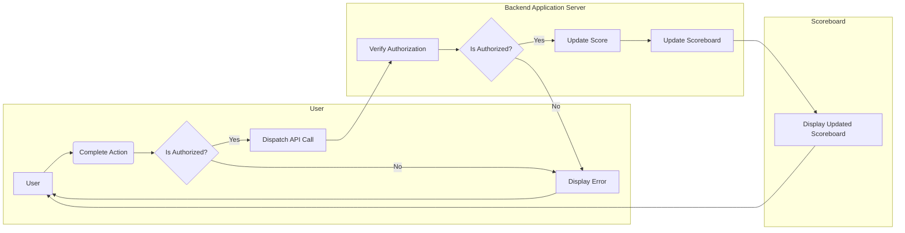

# API Service Module Specification

## Introduction

This specification document outlines the requirements and functionalities of the API service module for the backend application server. The module's purpose is to handle score updates for a website's scoreboard, ensuring live updates while preventing unauthorized score increases by malicious users.

## Table of Contents

- [API Service Module Specification](#api-service-module-specification)
  - [Introduction](#introduction)
  - [Table of Contents](#table-of-contents)
  - [API Usage](#api-usage)
    - [Endpoints](#endpoints)
    - [Request Format](#request-format)
    - [Response Format](#response-format)
  - [Action](#action)
  - [Technology Stack](#technology-stack)
  - [Error Handling](#error-handling)
  - [Request Examples](#request-examples)
  - [Flow of Execution](#flow-of-execution)
  - [Comments for Improvement](#comments-for-improvement)
  - [Testing and Deployment](#testing-and-deployment)

## API Usage

To use the API service module, you can interact with the provided API endpoints. The following section outlines the endpoints, request format, and response format.

### Endpoints

- `GET /scores`: Retrieves all scores from the score board.
- `POST /scores`: Adds a new score to the score board.
- `PUT /scores/{id}`: Updates a score with the specified ID.
- `DELETE /scores/{id}`: Deletes a score with the specified ID.

### Request Format

- `GET /scores`: No request body required.
- `POST /scores`:
  ```json
  {
    "username": "string",
    "score": 0
  }
  ```
- `PUT /scores/{id}`:
  ```json
  {
    "score": 0
  }
  ```

### Response Format

- `GET /scores`:
  ```json
  [
    {
      "id": "string",
      "username": "string",
      "score": 0
    },
    ...
  ]
  ```
- `POST /scores`, `PUT /scores/{id}`:
  ```json
  {
    "id": "string",
    "username": "string",
    "score": 0
  }
  ```

## Action

Users can perform various actions to increase their score. Examples of actions include completing tasks, answering questions correctly, or achieving specific milestones. The exact nature of these actions may vary depending on the specific implementation of the API service module.

## Technology Stack

The API service module is built using the following technologies and programming languages:

- Backend Platform: [Node.js](https://nodejs.org/)
- Backend Framework: [Express.js](https://expressjs.com/)
- Database: [MongoDB](https://www.mongodb.com) 

Please ensure that you have the necessary dependencies installed to run the module in your desired environment.

## Error Handling

The API endpoints may return error codes or responses in case of issues. Here are some common error codes and their meanings:

- `400 Bad Request`: The request was invalid or missing required parameters.
- `404 Not Found`: The requested resource was not found.
- `500 Internal Server Error`: An unexpected error occurred on the server.

## Request Examples

Here are some examples of API requests and their corresponding responses:

- `GET /scores`:
  - Request: `GET /scores`
  - Response:
    ```json
    [
      {
        "id": "1",
        "username": "John",
        "score": 100
      },
      {
        "id": "2",
        "username": "Jane",
        "score": 200
      }
    ]
    ```

- `POST /scores`:
  - Request:
    ```json
    {
      "username": "Alex",
      "score": 150
    }
    ```
  - Response:
    ```json
    {
      "id": "3",
      "username": "Alex",
      "score": 150
    }
    ```

- `PUT /scores/{id}`:
  - Request:
    ```json
    {
      "score": 250
    }
    ```
  - Response:
    ```json
    {
      "id": "2",
      "username": "Jane",
      "score": 250
    }
    ```

## Flow of Execution

The following flowchart illustrates the interaction between the user, the backend application server, and the scoreboard:


We have a system consisting of three components: the User, the Backend Application Server, and the Scoreboard. The User initiates an action, which is then completed. After the action is completed, the system checks whether the User is authorized to update their score or not. If the User is authorized, an API call is dispatched to the Backend Application Server.

Upon receiving the API call, the Backend Application Server verifies the authorization of the User. If the User is authorized, the server updates the User's score and then proceeds to update the Scoreboard. However, if the User is not authorized, an error message is displayed.

Finally, the updated Scoreboard is displayed to the User, completing the flow of execution. This flow ensures that only authorized Users can increase their scores, preventing any unauthorized score increases by malicious users.

## Comments for Improvement

While the API service module meets the specified requirements, there are opportunities for improvement:
- Implement rate limiting to prevent abuse and protect against potential DDoS attacks.
- Consider implementing token-based authentication to enhance security and scalability.
- Add unit tests and integration tests to ensure the reliability and stability of the module.
- Provide comprehensive error handling and meaningful error messages for better debugging and user experience.

## Testing and Deployment

To ensure the API service module works as expected, we recommend thorough testing in different environments. You can use automated testing frameworks or manually test the module's functionalities.

Deployment of the API service module depends on your specific setup and requirements.

Thank you for reading this API Service Module Specification. If you have any questions or need further assistance, please don't hesitate to reach out to our team.